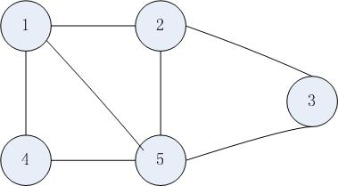
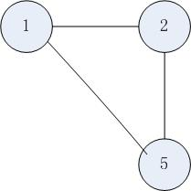
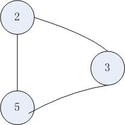
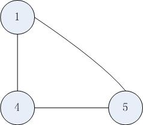
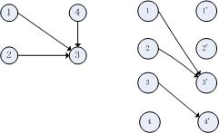

#[Link Partly Reverse](http://www.careercup.com/question?id=15138683)#

Reverse Linked list in parts iteratively.

ex 1->2->3->4->5->6->7->8 and if 'parts' is 3.

o/p = 3->2->1->6->5->4->8->7.

#[Vending Machine Problem](http://www.careercup.com/question?id=15139685)#

一开始认为是一个完全背包问题，但受到评论里面的提示知道，vending machine里面的每种硬币的数量是有限的，那么这道题又变成了
多重背包了

其实背包问题求最小值最大值都是可以的

#[最大独立集问题](http://www.careercup.com/question?id=15148712)#

>Given N sets of integers, remove some sets so that the remaining all sets are disjoint with one another. Find the optimal solution so that the number of sets remaining at the end is maximum.
please explain your algorithm properly rather than pasting code .   

##分析##

题目构造数学模型很简单，每一个集合看成一个点，如果两个集合中有相同的数字，则这两个集合对应的点相连接。最后会构成一个无向图，我们就是要求这个图的最大独立集。要求一个图的最大独立集就是求其补图的最大团。
##最大团##
这里介绍一下最大团
>给定一个无向图G=(V,E)，如果U属于E，且任意(u,v)属于U，且同时又属于E，则称U是G的完全子图。
>G的完全子图U是G的最大团当且仅当U不包含在G的更大的完全子图中，即U就是最大的完全子图。

如下图：

此图的最大团有：

  

那怎样求一个图的呢？朴素的搜索将会是n*2^n的时间复杂度，所以需要进行剪枝，并记录一些状态，即DP+DFS的思想。先把代码写出来。

	#define SIZE 102
	int mat[SIZE][SIZE];  /*图矩阵*/
	int dp[SIZE];
	int mx;
	int stack[SIZE][SIZE];
	void dfs(int N,int num,int step){
	
		if(num==0){
			if(step > mx){
				mx=step;
			}
			return ;
		}
	
		for(int i=0;i<num;i++){
			int k = stack[step][i];
			if(step+N-k<=mx) return ;
			if(step+dp[k]<=mx) return ;
			int cnt = 0;
			for(int j=i+1;j<num;j++)
				if(mat[k][stack[step][j]]){
				     stack[step+1][cnt++]=stack[step][j];
				}
			dfs(N,cnt,step+1);
		}
	}
	
	void run(int N){
	
		mx =0;
		for(int i=N-1;i>=0;i--){
			int sz =0;
			for(int j=i+1;j<N;j++)
				if(mat[i][j]) stack[1][sz++]=j;
			dfs(N,sz,1);
			dp[i]=mx;
		}
	}
	
下面简单地说一下思路（节点下标是从0开始的）：  
dp[i]表示从i到n-1中的最大团的节点数。   
枚举每一个节点，看这个节点与哪些编号大于它的节点相连，记录这些节点，然后递归地处理这些节点。。。    
怎样去做剪枝那？    
假如已经到x个节点在“团”里的状态，处理到了第k个节点，判断   
	x+n-k <= mx   
和   
	x+dp[k] <= mx     
两个条件。只要有一个成立，则没有必要继续下去了。    
##最大独立集##
**最大独立集就是其补图的最大团**     
[poj1419](http://poj.org/problem?id=1419)是一个很直白的求最大独立集的问题，可以试着做做         
###二分图的最大独立集###
如果一个图是二分图，那么它的最大独立集就是多项式时间可以解决的问题了 |最大独立集| = |V|-|最大匹配数|    
**证明：**   
设最大独立集数为U，最大匹配数为M，M覆盖的顶点集合为EM。    
为了证明|U|=|V|-|M|，我们分两步证明|U|<=|V|-|M|和|U|>=|V|-|M|   
1 先证明 |U|<=|V|-|M|     
M中的两个端点是连接的，所有M中必有一个点不在|U|集合中，所以|M|<=|V|-|U|    
2 再证明|U|>=|V|-|M|    
假设(x,y)属于M     
首先我们知道一定有|U|>=|V|-|EM|，那么我们将M集合中的一个端点放入U中可以吗？    
假设存在(a,x)，(b,y)，(a,b)不在EM集合中    
如果(a,b)连接，则有一个更大的匹配存在，矛盾     
如果(a,b)不连接，a->x->y->b有一个新的增广路，因此有一个更大的匹配，矛盾    
所以我们可以了解到**取M中的一个端点放入U中肯定不会和U中的任何一个点相连**，所以|U|>=|V|-|EM|+|M|=|V|-|M|    
所以，**|U|=|V|-|M|**

###二分图的最小顶点覆盖    
**定义：**    
>寻找一个点集，使得图上任意一条边至少一个端点位于这个点集内部。二分图的|最小点集|=|最大匹配|

**证明：**   
按照定义所说，就是最大匹配中的每个匹配的一个节点就是最小点集。    
如果有一条边的两个端点都不在EM中，那最大匹配就会变成|M|+1，产生矛盾。所以又|最小点集|<=|最大匹配|      
我们现在只看最大匹配M，如果最小点集小于M，那么肯定有边无法涉及到，因此|最小点集|>=|最大匹配|    
所以有**|最小点集|=|最大匹配|**    
**对于一个一般图是NP Hard的问题，对于二分图可能就是多项式可解的问题咯**

###最小路径覆盖###
**定义：**
>一个**有向无环图**，要求用尽量少的不相交的简单路径覆盖所有的节点。    

**构图：**    
>建立一个二分图，把原图中的所有节点分成两份（X集合为i，Y集合为i'），如果原来图中有i->j的有向边，则在二分图中建立i->j'的有向边。最终|最小路径覆盖|=|V|-|M|

**证明：**    

上图中，对应左边的DAG构造了右边的二分图，可以找到二分图的一个最大匹配M：1->3' 3->4'，那么M重的这两条匹配边怎样对应DAG中的路径的边呢？    
使二分图的一条边对应于DAG中的一条有向边：1->3'对应于左图的1->3，这样DAG中的1就有一个后继结点（3回事1的唯一后继结点，因为二分图中的一个顶点之多关联一条边！），**所以1不会成为DAG中的一条路径中的结尾顶点**，同样，3->4'对应于左图的3->4，**3也不会成为结尾顶点**，那么原图中总共有4个顶点，减去2个有后继的顶点，还有两个顶点，**即DAG路径的结尾顶点**，每个即为顶点对应一个路径。**二分图中寻找最大匹配M，就是找到了对应DAG中的非路径结尾顶点的最大数目，那么DAG中|V|-|M|就是DAG中结尾顶点的最小数目，即DAG的最小路径数目。**     
下面写一个二分图匹配的**递归方法**的代码：    
    
	#define SIZE 100
	
	int mat[SIZE][SIZE];  /*图矩阵*/
	
	int match1[SIZE];
	int match2[SIZE];
	
	int color[SIZE];
	
	bool dfs(int N,int u){
		for(int i=0;i<N;i++)
			if(mat[u][i] && color[i]){
				color[i]=1;
				if(match2[i]==-1){
					match2[i]=u;
					match1[u]=i;
					return true;
				}
				else{
					bool flag = dfs(N,match2[i]);
					if(flag){
						match2[i]=u;
						match1[u]=i;
						return true;
					}
				}
			}
		
		return false;
	}
	
	int maxMatch(int N){
		memset(match1,-1,sizeof(match1));
		memset(match2,-1,sizeof(match2));
		for(int i=0;i<N;i++){
			memset(color,0,sizeof(color));
			dfs(N,i);
		}
		int ret = 0;
		for(int i=0;i<N;i++)
			if(match1[i]!=-1) ++ret;
		return ret;
	}

再写一个二分图最大匹配的**非递归方法**：    

	#define SIZE 100
	
	int mat[SIZE][SIZE]; /*图矩阵*/
	
	int match1[SIZE];
	int match2[SIZE];
	
	int queue[SIZE];
	int head,tail;
	
	int pre[SIZE];
	
	int maxMatch(int N){
		int ret = 0;
		memset(match1,-1,sizeof(match1));
		memset(match2,-1,sizeof(match2));
	
		for(int i=0;i<N;i++){
			memset(pre,-1,sizeof(pre));
			head = tail = 0;
			queue[tail++] = i;
			while(head < tail && match1[i]==-1){
				int u = queue[head++];
				for(int j =0;j<N&&match1[i]==-1;j++)
					if(mat[u][j] && pre[j]==-1){
						queue[tail++] = match2[j];
						pre[j]=u;
						if(queue[tail-1]<0){
							for(int t=j,k=0;t>=0;j=t){
								match2[j]=k=pre[j];
								t=match1[k];
								match1[k]=j;
							}
						}
					}
			}
		}
	}

#[寻找第一个1](http://www.careercup.com/question?id=15314751)#
>一个排好序的数组，数组中只有0和1，设计一个算法找到第一个1出现的位置，需要注意数组的长度不可知，可能很大   

##分析：##
数组的长度不可知，所以不能使用朴素的二分算法，所以我们要对二分算法做一个改进：     
我们首先检查0的位置是否为1，如果是则找到了；如果不是则检查2位置，然后是4、8、16...2^n    
如果2^k位置是1，则我们可以在(2^k-1,2^k]区间进行二分搜索。     
2的幂次方的增长速度很快，二分搜索也很快，这个算法还是很高效的，应该是log级的时间复杂度。    

#[实现sizeof()](http://www.careercup.com/question?id=15315788)#
>实现一个类似于C语言中的sizeof    

C语言中的sizeof是一个运算符，它在代码被编译时就进行解析了，现在可以写一个准对简单数据的一个版本，但真的数组和结构体的版本还没有想出来。先说一下针对简单类型的代码：   
  
	#define mysizeof(x) ({typeof(x) _x;((char*)(&_x+1))-((char*)(&_x));})

如果我们在main函数中写入如下代码：     
	
	cout<<mysizeof(short)<<endl;   // output : 2

结果将输出2。

###2013.2.16 Modification
今天对上面实现的sizeof做一个说明：    
1.原来的sizeof函数可以对**数组和结构体**进行处理的，处理方式如下：

	int array[4];
	cout<<mysizeof(array)<<endl;   // output : 16
	
	struct Node{
		int a;
		short b;
	};
	Node n;
	cout<<mysizeof(n)<<endl;     // output:8 in my llvm compiler
	cout<<mysizeof(Node)<<endl;   // output : 8 in my llvm compiler
	
	typedef int array4[4];
	array4 arr;
	cout<<mysizeof(arr)<<endl;   // output : 16
	cout<<mysizeof(array4)<<endl;   // output : 16
	
2.在看C++ Primer的时候，看到了泛型编程，想到可以写一个函数带得到数组的大小：

	template<class T, int N>
	int mysizeofarray(T (&arr)[N]){
		return mysizeof(T)*N;
	}
	

